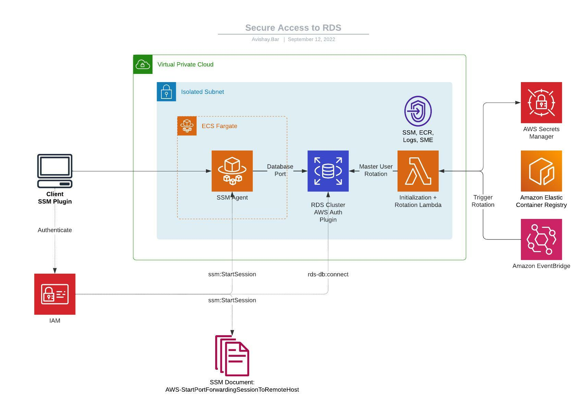

# Secure DB Connection using IAM and Systems Manager

## Introduction

This is a CDK project that demonstates the concept of using several AWS capabilities and services,
to provide a secure access from a client computer to RDS database.

## Motivation

Usually when we look at typical AWS deployment that involves a database instance, and not a managed service like DynamoDB,
you're going to need administrative access to this database for development, debugging and maintainance purposes.

Deployments seen in the wild are usually configured in one of the following:
- DB Cluster in public subnet, with security group that allows access from specific IP addresses.
- DB Cluster in private subnet, with a Bastion host deployed on public subnet and security group that allows access from specific IP addresses.
- DB Cluster in private subnet, with VPN access using Client VPN or Site to Site VPN configuration.

While these deployments are not neccesarily insecure, they require high maintainance operations, such as patching instances, managing security group ingress rules, rotating VPN certificates and settings etc, which by themselves broaden the attack surface and might expose the organization to security risks and potential misconfigurations.

## Solution Details and Architecture



Fortunately, AWS provide us with tools and configurations to overcome all those obstacles. The proposed solution relies on IAM for access management both for the database and bastion, and eliminates using passwords or SSH keypairs, and managing security groups.

The solution utilizes the following services:
- ECS Fargate - Provision a managed, read only container instance with SSM agent deployed.
- Systems Manager - Using SSM Document `AWS-StartPortForwardingSessionToRemoteHost` to initiate a managed port forwarding session with explicit permission to do so.
- RDS IAM Authentication - Provide temporary, token based authentication for the RDS cluster instead of using passwords.

## Deployment

The initialization
process creates a virtualenv within this project, stored under the `.venv`
directory.  To create the virtualenv it assumes that there is a `python3`
(or `python` for Windows) executable in your path with access to the `venv`
package. If for any reason the automatic creation of the virtualenv fails,
you can create the virtualenv manually.

To manually create a virtualenv on MacOS and Linux:

```
$ python3 -m venv .venv
```

After the init process completes and the virtualenv is created, you can use the following
step to activate your virtualenv.

```
$ source .venv/bin/activate
```

If you are a Windows platform, you would activate the virtualenv like this:

```
% .venv\Scripts\activate.bat
```

Once the virtualenv is activated, you can install the required dependencies.

```
$ pipenv install --dev
```

At this point you can now deploy the CloudFormation template for this solution.

```
$ cdk deploy
```

To add additional dependencies, for example other CDK libraries, just add
them to your `setup.py` file inside the `cdk` folder and run `pip update --dev`
command.

## Creating the ssh configuration

Make sure that you're authenticated as a privileged user to the AWS account, then run:
```
export AWS_REGION=[YOUR REGION]
python scripts/ssh_tunnel_to_rds.py
````

Then, activate the tunnel running:
```
ssh ssm-db-proxy
```

On another shell, then run the command you received from the prompt, something like:
```
./scripts/mysql_connect.sh --region eu-west-1 --stack SecureDbConnectionStack
```

You'll be prompted with the MySQL prompt! Securely connected with temporary credentials.